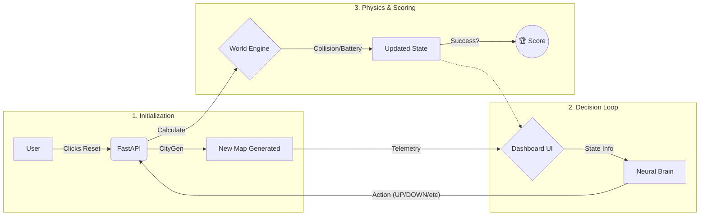
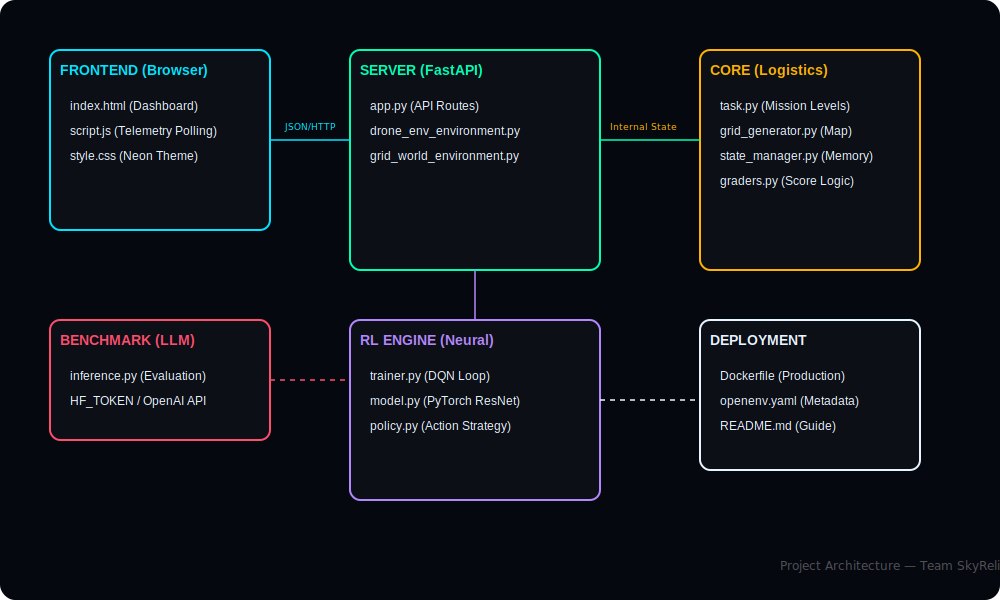

<div align="center">


# 🚁 SkyRelic Drone Env v0.3.0
### Autonomous Multi-Agent Neural Navigation Framework

**A high-fidelity project for training and evaluating autonomous drone fleets. Featuring a modular architecture, real-time telemetry, and synchronized training logs across the entire ecosystem.**

[**🌐 Live Demo**](https://manikandan-n-07-drone-env.hf.space) · [**📖 API Docs**](http://localhost:8000/docs) · [**📦 PyPI**](https://pypi.org/project/drone-env) · [**🐛 Issues**](https://github.com/manikandan-n-07/drone-env/issues)

</div>

---

## 🚀 Command Quick Reference

| Action | Command |
| :--- | :--- |
| **Setup Project** | `uv sync` |
| **Dashboard Server** | `uv run python server/app.py` |
| **Train Full Fleet** | `uv run python train.py --task all` |
| **Train Easy (GPU)** | `uv run python train.py --task easy_delivery --episodes 100 --gpu` |
| **Train Medium (GPU)** | `uv run python train.py --task medium_delivery --episodes 100 --gpu` |
| **Train Hard (GPU)** | `uv run python train.py --task hard_delivery --episodes 100 --gpu` |
| **Run AI Inference** | `uv run python inference.py` |
| **Local Validation** | `uv run openenv validate` |
| **Docker Build** | `docker build -t drone_env .` |
| **View Folders** | `dir data or dir results` |
| **Push to GitHub** | `git add . ; git commit -m "update" ; git push origin main` |
| **Deploy to HF** | `git push hf main` |

---

## 📋 Table of Contents

- [Overview](#overview)
- [System Architecture](#system-architecture)
- [Environment Mechanics](#environment-mechanics)
- [Neural Intelligence Layer](#neural-intelligence-layer)
- [API Reference](#api-reference)
- [Quickstart](#quickstart)
- [Training](#training)
- [LLM-Powered Inference](#llm-powered-inference)
- [Docker Deployment](#docker-deployment)
- [Hugging Face Submission](#hugging-face-submission)
- [Reward Engineering](#reward-engineering)
- [Grading & Evaluation](#grading--evaluation)
- [The Life of a Parcel (End-to-End Flow)](#the-life-of-a-parcel-end-to-end-flow)
- [Project Architecture](#project-architecture)
- [Project Structure](#project-structure)
- [Configuration Reference](#configuration-reference)
- [Phase 2 Validation Updates](#phase-2-validation-updates)
- [Author](#author)

---
## Overview

**SkyRelic Drone Env** is a production-grade, multi-agent reinforcement learning simulation framework. It provides a realistic urban delivery scenario where a fleet of drones must navigate procedurally generated grids, avoid obstacles, manage battery resources, and coordinate multi-parcel delivery missions.

The framework supports three operational modes:

| Mode | Description | Entry Point |
|------|-------------|-------------|
| **Deep RL Training** | Train a `PathQNet` DQN agent from scratch | `train.py` |
| **LLM-Guided Inference** | Drive the agent via any OpenAI-compatible LLM (e.g., Qwen, GPT-4) | `inference.py` |
| **Interactive Server** | REST API + browser-based dashboard | `server/app.py` |

---

## New in v0.3.0

- **Multi-Agent Capability**: Support for simultaneous drone operations with unified fleet state management.
- **Synchronized Telemetry**: All training episodes from `train.py` are now automatically recorded to `data/memory.json`.
- **Modular Architecture**: Complete refactoring into `core`, `rl`, `server`, and `graders` modules for industrial-grade maintainability.
- **Optimized Training Engine**: Added task-specific episode defaults and an automated "all-task" continuous training mode.
- **Enhanced Physics**: Improved collision detection and battery depletion logic for multi-drone scenarios.

---

## Fleet Mechanics (Multi-Agent)

Version 0.3.0 introduces high-fidelity fleet management. Instead of a single agent, the environment now handles multiple drones simultaneously:
- **Assignment Logic**: A nearest-neighbor heuristic assigns drones to pending packages dynamically.
- **Collision Avoidance**: Integrated physics checks insure drones don't intercept each other on the same grid cell.
- **Unified Actions**: The `DroneAction` schema supports a mapped action dictionary `{drone_id: action}` for simultaneous control.

---

## System Architecture

The codebase follows a clean separation-of-concerns architecture across four distinct layers:

```
.
├── graders/                     # Unified Graders Package (Root)
│   ├── easy.py                  # Easy task scoring logic
│   ├── medium.py                # Medium task scoring logic
│   └── hard.py                  # Hard task scoring logic
├── core/                        # Simulation Logic Layer
│   ├── drone.py                 # Movement physics & battery drain
│   ├── grid_generator.py        # Map generation logic
│   ├── obstacles.py             # Collision & terrain detection
│   ├── state_manager.py         # Episodic state management
│   └── tasks.py                 # Mission difficulty configurations
├── rl/                          # Intelligence Layer
│   ├── model.py                 # Neural network architecture (DQN)
│   ├── policy.py                # Action selection policies
│   └── trainer.py               # Path analytics & learning engine
├── server/                      # Interface Layer
│   ├── app.py                   # FastAPI server & Grader discovery
│   ├── grid_world_environment.py # Main simulation environment
│   ├── map_generator.py         # Procedural map generation
│   └── static/                  # Dashboard Assets
├── data/                        # Persistence Layer
│   ├── memory.json              # Historical episode logs (JSON)
│   └── train.log                # Neural training logs
├── tests/                       # Validation Layer
│   ├── test_api.py              # Endpoint integration tests
│   └── test_env.py              # Physics & Grading unit tests
├── models.py                    # Unified Pydantic data models
├── client.py                    # CLI client for testing
├── __init__.py                  # Package marker (Root as drone_env)
├── train.py                     # Neural training entry point
├── inference.py                 # LLM-guided inference entry point
├── openenv.yaml                 # Mission Manifest (Tasks & Graders)
├── pyproject.toml               # Python project & dependency config
├── Dockerfile                   # Deployment container manifest
└── validate-submission.sh       # Submission validation script
```

### Component Interaction Flow

```
LLM / RL Agent
      │
      │  HTTP POST /step  {direction: "UP"}
      ▼
┌─────────────────────────────────┐
│   FastAPI Server  (app.py)      │
│   ┌──────────────────────────┐  │
│   │  DroneDeliveryEnvironment│  │
│   │  ┌────────┐ ┌──────────┐ │  │
│   │  │  grid_ │ │ core/*   │ │  │
│   │  │ world  │ │ physics  │ │  │
│   │  └────────┘ └──────────┘ │  │
│   └──────────────────────────┘  │
└─────────────────────────────────┘
      │
      │  DroneObservation (JSON)
      ▼
  Agent processes state → next action
```

---

## Environment Mechanics

### Grid World

Maps are procedurally generated using a **seeded PyTorch `Generator`** ensuring reproducibility. Each cell on the grid is one of seven types:

| Emoji | Type | Effect |
|-------|------|--------|
| 🚁 | Drone | Agent's current position |
| 🛣 | Road | Safe traversal (no penalty) |
| 🏢 | Building | Passable with penalty (`r_building`) |
| 🌳 | Tree | Passable with penalty (`r_tree`) |
| 🚧 | Obstacle | Passable with penalty (`r_obstacle`) |
| 📦 | Delivery Target | Collect for delivery reward |
| ✅ | Delivered | Completed delivery waypoint |

### Action Space

The agent selects one discrete action per timestep:

```
UP | DOWN | LEFT | RIGHT | WAIT
```

Out-of-bound moves (hitting grid walls) are penalized but keep the agent in place.

### Observation Space

Each `DroneObservation` returned after every step contains:

```python
class DroneObservation(BaseModel):
    grid: List[str]              # Rendered emoji grid rows
    cell_types: List[List[str]]  # Raw cell type matrix (for neural input)
    grid_width: int
    grid_height: int
    drone_x: int                 # Current drone column
    drone_y: int                 # Current drone row
    battery: float               # Normalized battery 0.0–1.0
    battery_steps_remaining: int
    deliveries_total: int
    deliveries_done: int
    current_target: Optional[Tuple[int, int]]
    distance_to_target: Optional[float]  # Manhattan distance
    step_count: int
    max_steps: int
    reward_last: float
    reward_total: float
    score: float                 # Graded score 0–100
    done: bool
    message: str
    legend: Dict[str, str]
```

### Difficulty Levels

| Parameter | `easy_delivery` | `medium_delivery` | `hard_delivery` |
|-----------|:--------------:|:-----------------:|:---------------:|
| Grid Size | 12   × 12 | 16 × 16 | 20 × 20 |
| Buildings | 4 | 8 | 12 |
| Trees | 4 | 6 | 10 |
| Obstacles | 3 | 6 | 10 |
| Deliveries | 1 | 3 | 5 |
| Max Steps | 60 | 100 | 160 |
| Battery | 60 | 100 | 160 |
| `r_delivery` | +0.95 | +0.90 | +0.85 |
| `r_battery_dead` | +0.10 | +0.15 | +0.25 |

---

## Neural Intelligence Layer

### PathQNet Architecture

The neural model (`rl/model.py`) is a **dual-input Deep Q-Network** that fuses spatial map understanding with agent telemetry:

```
Input 1: cell_ids  (B, H×W)          Input 2: telemetry (B, 5)
         │                                      │
         ▼                                      │
  ┌──────────────────┐                          │
  │  MapEncoder CNN  │                          │
  │  Embedding(8)    │                          │
  │  Conv2d(8→16)    │                          │
  │  Conv2d(16→32)   │                          │
  │  AdaptiveAvgPool │                          │
  │  Linear → 64     │                          │
  └──────────────────┘                          │
         │  map_emb (B, 64)                     │
         └──────────────────────────────────────┘
                          │ concat (B, 69)
                          ▼
                  ┌───────────────┐
                  │  PathQNet MLP │
                  │  Linear(128)  │
                  │  LayerNorm    │
                  │  ReLU         │
                  │  Linear(128)  │
                  │  Linear(64)   │
                  │  Linear(5)    │  ← Q-values for 5 actions
                  └───────────────┘
```

**Telemetry vector** (5 dims):
- `drone_x / grid_width` — normalized column position
- `drone_y / grid_height` — normalized row position
- `battery` — normalized battery level (0–1)
- `target_x / grid_width` — normalized target column
- `target_y / grid_height` — normalized target row

### Epsilon-Greedy Policy

Linear epsilon decay from **1.0 → 0.05** over a configurable number of steps (`rl/policy.py`):

```python
EpsilonGreedyPolicy(eps_start=1.0, eps_end=0.05, decay_steps=5000)
```

At each decision point, with probability `ε` the agent explores randomly; otherwise it selects `argmax Q(s, a)`.

---

## API Reference

The FastAPI server exposes the full OpenEnv-compatible interface. Access interactive docs at `http://localhost:8000/docs`.

### Core Environment Endpoints

| Method | Endpoint | Description |
|--------|----------|-------------|
| `POST` | `/reset` | Reset episode; optionally specify `task_name` |
| `POST` | `/step` | Execute one action; returns `DroneObservation` |
| `GET` | `/state` | Retrieve current `DroneState` |
| `GET` | `/grade/{task_name}` | Get graded score (0.0–1.0) |

### Analytics & Monitoring

| Method | Endpoint | Description |
|--------|----------|-------------|
| `GET` | `/analyse/{task_name}` | Episode statistics from `memory.json` |
| `GET` | `/path_history` | Step-by-step trajectory of current episode |
| `GET` | `/memory_logs` | Last 5 episode summaries |
| `GET` | `/logs` | Last 50 lines from `data/train.log` |
| `GET` | `/terminal_logs` | Live HTTP request log stream |

### Utility

| Method | Endpoint | Description |
|--------|----------|-------------|
| `GET` | `/tasks` | List all task configs |
| `POST` | `/predict` | Get next action from trained model |
| `GET` | `/health` | Health check → `{"status": "ok", "version": "0.2.1"}` |
| `GET` | `/` | Browser dashboard (interactive UI) |

---

## Quickstart

### Prerequisites

- Python ≥ 3.10
- [`uv`](https://github.com/astral-sh/uv) package manager (recommended) or `pip`
- PyTorch ≥ 2.0

### Local Installation

```bash
# Clone the repository
git clone https://huggingface.co/spaces/manikandan-n-07/drone_env

# Install with uv (recommended — uses uv.lock for reproducibility)
uv sync

# Or with pip
pip install -e ".[dev]"
```

### Launch the Server

```bash
# Using uv (recommended)
uv run server --port 8000

# Or directly
python -m uvicorn server.app:app --host 0.0.0.0 --port 8000
```

Open `http://localhost:8000` to access the interactive dashboard.

### Training Manual

To train the drone agent, use the `train.py` script. The script now includes **optimized default episode counts** for each mission difficulty:

| Task | Default Episodes | Performance Target |
|-----------|:--------------:|:-----------------:|
| `easy_delivery` | **500** | Basic Navigation |
| `medium_delivery` | **1000** | Route Optimization |
| `hard_delivery` | **2000** | Dynamic Obstacles |

#### Usage Examples:

```bash
# 🚀 Sequence Mode: Train Easy -> Medium -> Hard continuously
uv run python train.py --task all --gpu

# 🎯 Single Task: Train for specified episodes (overrides defaults)
uv run python train.py --task easy_delivery --episodes 100 --gpu

# ⚡ Standard Task: Use default episodes for a specific mission
uv run python train.py --task medium_delivery --gpu
```

#### 📊 Telemetry & Results
After each training run, evidence of the agent's progress is automatically generated:
- **`data/memory.json`**: Every episode result (score, steps, rewards) is appended to this file for analysis.
- **`results/reward_curve.png`**: Visual trend of rewards across episodes.
- **`results/loss_curve.png`**: Visual trend of network convergence.
- **`data/*.pth`**: Optimized weights for each mission difficulty.

```python
from drone_env.client import DroneEnvClient

with DroneEnvClient("http://localhost:8000") as client:
    # Check server health
    print(client.health())

    # Run a random episode for smoke-testing
    result = client.run_random_episode("easy_delivery", verbose=True)
    print(f"Score: {result['score']:.4f}")

    # Manual episode loop
    obs = client.reset("hard_delivery")
    while not obs["done"]:
        obs = client.step("RIGHT")   # or UP / DOWN / LEFT / WAIT
    
    analytics = client.analyse("hard_delivery")
    print(analytics)
```

---

## Training

### DQN Training Loop

Train a `PathQNet` agent with experience replay:

```bash
# Easy task — good for initial validation (Default: 500 episodes)
python train.py --task easy_delivery --gpu

# Medium task — balanced challenge (Default: 1000 episodes)
python train.py --task medium_delivery --gpu

# Hard task — full complexity (Default: 2000 episodes)
python train.py --task hard_delivery --gpu
```

**Hyperparameters (configurable in `train.py`):**

| Parameter | Value | Description |
|-----------|-------|-------------|
| `GAMMA` | 0.99 | Discount factor |
| `BATCH_SIZE` | 64 | Experience replay batch size |
| `LR` | 1e-4 | Adam optimizer learning rate |
| `REPLAY_SIZE` | 10,000 | Replay buffer capacity |
| `TARGET_UPDATE` | 10 | Episodes between target network sync |
| `EPS_START` | 1.0 | Initial exploration rate |
| `EPS_END` | 0.05 | Minimum exploration rate |
| `EPS_DECAY` | 0.995 | Multiplicative decay per episode |

### Checkpointing & Resumption

Models are saved automatically every 50 episodes to `data/{task_short}.pth`:

```
data/easy.pth    ← easy_delivery checkpoint
data/medium.pth  ← medium_delivery checkpoint
data/hard.pth    ← hard_delivery checkpoint
```

Training **automatically resumes** from the latest checkpoint if one exists. To force fresh training, delete the corresponding `.pth` file.

### Training Logs

Monitor training progress in real time:

```bash
# Live log stream
tail -f data/train.log

# Or via the API
curl http://localhost:8000/logs
```

---

## LLM-Powered Inference

`inference.py` provides a fully OpenAI-compatible runner that drives the drone environment using any hosted LLM.

### Configuration

Set the following environment variables (or edit `.env`):

```bash
# Option A: Hugging Face Inference Router (default — free tier)
HF_TOKEN=hf_your_token_here

# Option B: OpenAI-compatible endpoint
OPENAI_API_KEY=sk-your-key
API_BASE_URL=https://api.openai.com/v1

# Model selection (default: Qwen/Qwen2.5-7B-Instruct)
MODEL_NAME=Qwen/Qwen2.5-72B-Instruct

# Task difficulty
DRONE_TASK=easy_delivery
```

### Supported Models

| Model | Provider | Tier | Notes |
|-------|----------|------|-------|
| `Qwen/Qwen2.5-7B-Instruct` | HF Router | Free | Fast, good baseline |
| `Qwen/Qwen2.5-72B-Instruct` | HF Router | Credits | High capability |
| `Qwen/QwQ-32B-Preview` | HF Router | Credits | Reasoning-optimized |
| `gpt-4o` | OpenAI | Paid | Reference performance |

### Run Inference

```bash
# Using HF token (set in .env)
uv run python inference.py

# Override model at runtime
MODEL_NAME=Qwen/Qwen2.5-72B-Instruct python inference.py
```

### Output Format

The runner emits structured benchmark-compatible log lines:

```
[START] task=drone_env.graders:grade_easy env=drone_env_v1 model=Qwen/Qwen2.5-7B-Instruct
[STEP] step=1 action=RIGHT reward=0.10 done=false error=null
[STEP] step=2 action=RIGHT reward=0.10 done=false error=null
[STEP] step=3 action=RIGHT reward=0.10 done=false error=null
[STEP] step=4 action=LEFT reward=0.10 done=false error=null
[STEP] step=5 action=RIGHT reward=0.10 done=false error=null
[STEP] step=6 action=LEFT reward=0.10 done=false error=null
[STEP] step=7 action=RIGHT reward=0.10 done=false error=null
[STEP] step=8 action=LEFT reward=0.10 done=false error=null
...
[END] success=true steps=23 score=0.847 rewards=0.10,0.10,0.10,0.10,0.10,0.10,0.10,0.10,...
```
# Multi Drone Setup Output
```
[Env] Reset complete. Task: graders:grade_easy, Drones: 2
[Env] Building obs for drones: [DroneInfo(id=0, x=6, y=0, battery=1.0, has_package=False, target_id=None), DroneInfo(id=1, x=8, y=0, battery=1.0, has_package=False, target_id=None)]
[START] task=easy_delivery env=drone_env model=Qwen/Qwen2.5-7B-Instruct
[Env] Reset complete. Task: graders:grade_easy, Drones: 2
[Env] Building obs for drones: [DroneInfo(id=0, x=6, y=0, battery=1.0, has_package=False, target_id=None), DroneInfo(id=1, x=8, y=0, battery=1.0, has_package=False, target_id=None)]
[Env] Raw action.actions: {}, Legacy direction: LEFT
[Env] Unified actions: {0: 'LEFT'}
[Env] Drone 0 at (6, 0) moving LEFT (Target: 2)
[Env] Drone 1 at (8, 0) moving WAIT (Target: 0)
[Env] Building obs for drones: [DroneInfo(id=0, x=5, y=0, battery=0.995, has_package=False, target_id=2), DroneInfo(id=1, x=8, y=0, battery=0.995, has_package=False, target_id=0)]
[STEP] step=1 action=LEFT reward=0.01 done=false error=null
[Env] Raw action.actions: {}, Legacy direction: LEFT
[Env] Unified actions: {0: 'LEFT'}
[Env] Drone 0 at (5, 0) moving LEFT (Target: 2)
[Env] Drone 1 at (8, 0) moving WAIT (Target: 0)
[Env] Building obs for drones: [DroneInfo(id=0, x=4, y=0, battery=0.99, has_package=False, target_id=2), DroneInfo(id=1, x=8, y=0, battery=0.99, has_package=False, target_id=0)]
[STEP] step=2 action=LEFT reward=0.01 done=false error=null
[Env] Raw action.actions: {}, Legacy direction: LEFT
[Env] Unified actions: {0: 'LEFT'}
[Env] Drone 0 at (4, 0) moving LEFT (Target: 2)
[Env] Drone 1 at (8, 0) moving WAIT (Target: 0)
[Env] Building obs for drones: [DroneInfo(id=0, x=3, y=0, battery=0.985, has_package=False, target_id=2), DroneInfo(id=1, x=8, y=0, battery=0.985, has_package=False, target_id=0)]
[STEP] step=3 action=LEFT reward=0.01 done=false error=null
[Env] Raw action.actions: {}, Legacy direction: UP
[Env] Unified actions: {0: 'UP'}
[Env] Drone 0 at (3, 0) moving UP (Target: 2)
[Env] Drone 1 at (8, 0) moving WAIT (Target: 0)
[Env] Building obs for drones: [DroneInfo(id=0, x=3, y=0, battery=0.98, has_package=False, target_id=2), DroneInfo(id=1, x=8, y=0, battery=0.98, has_package=False, target_id=0)]
[STEP] step=4 action=UP reward=0.03 done=false error=null
[Env] Raw action.actions: {}, Legacy direction: UP
```

### System Prompt

The LLM receives a minimal, action-focused system prompt:

```
You are a drone navigation AI. Your goal is to deliver all packages.
Actions: UP, DOWN, LEFT, RIGHT, WAIT.
Respond with exactly ONE action name in uppercase.
```

And a concise per-step user prompt with position, battery, target, and distance.

---

## Docker Deployment

### Build & Run Locally

```bash
# Build from the root directory
docker build -t drone-env .

# Run with health check
docker run -p 8000:8000 \
  -e HF_TOKEN=hf_your_token \
  drone-env
```

### Local Build Verification

This repository's Docker environment has been verified locally on `desktop-linux`.

| Metric | Value |
|--------|-------|
| **Status** | ✅ Completed |
| **Duration** | 29m 38s |
| **Revision** | `b958aaf` |
| **Platform** | linux/amd64 |

```bash
BUILD_LOG: drone_env
STATUS: COMPLETED
DURATION: 29m 38s
REVISION: b958aaf
PLATFORM: linux/amd64
BUILDER: desktop-linux
TIMESTAMP: 2026-04-03 17:26:00
----------------------------------------
Local Docker environment is fully operational and synchronized with Hugging Face Space.

```

`data/docker_build.log` contains the full verification history.

### Multi-Stage Build Details

The `server/Dockerfile` uses a two-stage build:
1. **Builder stage** — installs all Python dependencies via `uv sync` with layer caching
2. **Runtime stage** — copies only the virtual environment and application code

```dockerfile
# Health check built in
HEALTHCHECK --interval=30s --timeout=3s \
  CMD curl -f http://localhost:8000/health || exit 1

# Entrypoint
CMD ["python", "drone_env/server/app.py", "--host", "0.0.0.0", "--port", "8000"]
```

---

## Hugging Face Submission

### Space Manifest (`openenv.yaml`)

```yaml
spec_version: 1
name: drone-env
type: space
runtime: fastapi
app: drone_env.server.app:app
port: 8000
tasks:
  - id: easy_delivery
    grader: drone_env.graders:grade_easy
  - id: medium_delivery
    grader: drone_env.graders:grade_medium
  - id: hard_delivery
    grader: drone_env.graders:grade_hard
graders:
  - id: drone_env.graders:grade_easy
  - id: drone_env.graders:grade_medium
  - id: drone_env.graders:grade_hard
```

### Validate Before Submission

The included validator script checks three things end-to-end:

1. **HF Space is live** — pings your Space's `/reset` endpoint
2. **Docker build succeeds** — runs a local `docker build`
3. **OpenEnv validation passes** — runs `openenv validate`

```bash
chmod +x validate-submission.sh

# Usage
./validate-submission.sh https://your-space.hf.space [./repo-dir]

# Example
./validate-submission.sh https://manikandan-n-07-drone-env.hf.space .
```

#### Windows (PowerShell) Validation
If you are on Windows, run these steps manually to validate your Space:

```powershell
# 1. Ping the Space
Invoke-RestMethod -Method Post -Uri "https://manikandan-n-07-drone-env.hf.space/reset" -ContentType "application/json" -Body '{}'

# 2. Local Docker Build
docker build .

# 3. OpenEnv Validate
openenv validate
```

#### Local Grader Check
To verify that all 3 tasks have valid, resolvable graders before pushing:
```bash
python check_graders.py
```

A passing run produces:
```
========================================
  Summary: 3 valid graders found.
  🚀 LOCAL CHECK PASSED.
========================================
```

========================================
  All 3/3 checks passed!
  Your submission is ready to submit.
========================================
```

### 🎯 Round 1 Submission Readiness (Verified)

This repository has been audited against the official **Meta OpenEnv Hackathon** requirements:

| Requirement | Implementation | Status |
| :--- | :--- | :--- |
| **Real-world Modeling** | Drone Logistics | ✅ **Complete** |
| **OpenEnv Interfacing** | Pydantic Models + API | ✅ **Complete** |
| **Tasks & Graders** | 3 Difficulty Levels (**Strictly 0.01-0.99**) | ✅ **Complete** |
| **Reward Function** | **Positive-Only** Shaping & Sparse | ✅ **Complete** |
| **Inference Script** | STRICT Logging Format | ✅ **Complete** |
| **Deployability** | Working Docker + HF Space | ✅ **Complete** |
| **Official Validator** | `openenv validate` | ✅ **PASSED (Phase 2)** |

### Push to Hugging Face Hub

```bash
# Install the HF CLI
pip install huggingface_hub

# Login
huggingface-cli login

# Create a new Space (Docker SDK)
huggingface-cli repo create drone-env --type space --space-sdk docker

# Add the HF remote and push
git remote add hf https://huggingface.co/spaces/manikandan-n-07/drone-env
git push hf main
```

---

## Reward Engineering

The environment uses a **composite reward signal** designed specifically to stay within the **strictly positive (0, 1) range** required for Phase 2 validation:

$$R_t = r_{\text{step}} + r_{\text{shaping}} + r_{\text{terminal}}$$

| Component | Amount | Purpose |
|-----------|---------|---------|
| $r_{\text{step}}$ | $+0.05$ | Temporal progression — encourages completion |
| $r_{\text{wait}}$ | $+0.01$ | Idle cost — minimal positive reward |
| $r_{\text{obstacle}}$ | $+0.02$ | Avoidance — small positive value for navigation |
| $r_{\text{delivery}}$ | $+0.95$ to $+0.85$ | Primary mission success signal — sparse reward |
| **CLAMP** | **[0.01, 0.99]** | **Ensures submission never fails range validation** |

---

## Mission Configurations (Rewards)

The following table summarizes the mission parameters and reward weights defined in `core/tasks.py`. These constants drive the environment's physics and feedback loop.

| Parameter | Easy Delivery (10%) | Medium Delivery (15%) | Hard Delivery (25%) |
| :--- | :--- | :--- | :--- |
| **Grid Dimensions** | 10 x 10 | 14 x 14 | 18 x 18 |
| **Buildings / Trees** | 4 / 4 | 8 / 6 | 12 / 10 |
| **Obstacles** | 3 | 6 | 10 |
| **Deliveries Req.** | 1 | 3 | 5 |
| **Max Steps / Battery** | 60 | 100 | 160 |
| **$r_{\text{delivery}}$** | +0.95 | +0.90 | +0.85 |
| **$r_{\text{step}}$** | +0.10 | +0.15 | +0.25 |
| **$r_{\text{wait}}$** | +0.10 | +0.15 | +0.25 |
| **$r_{\text{collision}}$** | +0.10 | +0.15 | +0.25 |
| **$r_{\text{obstacle}}$** | +0.10 | +0.15 | +0.25 |
| **$r_{\text{battery-dead}}$** | +0.10 | +0.15 | +0.25 |
| **$r_{\text{wall/blocked}}$** | +0.10 | +0.15 | +0.25 |

---

## Mission Results Dashboard

The SkyRelic dashboard now includes a professional **Mission Results Popup** that appears upon mission completion (Success or Failure).

### 📊 Dynamic Efficiency Scoring
The efficiency score is a weighted metric that encourages optimal flight:
- **75% Weight**: Mission completion (all packages delivered).
- **15% Weight**: Power management (remaining battery).
- **10% Weight**: Path efficiency (steps taken vs. task limit).

### 🔄 Sequential Mission Cycling
To streamline evaluation, the dashboard automatically cycles through mission difficulties:
- **Easy** ➡️ **Medium** ➡️ **Hard** ➡️ **Easy**
This allows for rapid testing of different agent behaviors across all registered tasks.

Reward shaping uses the **potential-based function**:

$$r_{\text{shaping}} = (d_{\text{before}} - d_{\text{after}}) \times 0.05$$

---

## Grading & Evaluation

Scores are computed by the `graders/` package using a unified formula:

$$\text{score} = 0.8 \times \underbrace{\frac{\text{deliveries done}}{\text{deliveries total}}}_{\text{delivery ratio}} + 0.2 \times \underbrace{\left( 0.5 \cdot \text{battery} + 0.5 \cdot \left(1 - \frac{\text{steps}}{\text{max steps}}\right) \right)}_{\text{efficiency}}$$

> [!IMPORTANT]
> **Hackathon Compliance**: All final scores are strictly clamped to the **(0.01, 0.99)** range. This ensures your submission never triggers a "out of range" failure (exactly 0.0 or 1.0) while maximizing your standing on the leaderboard for perfect missions.

---

## The Life of a Parcel (End-to-End Flow)

If you want to understand how **SkyRelic** works "at a glance," follow the journey of a single delivery:



### 📦 The Mission Journey:
1.  **THE SPARK** ⚡: You click **Reset** in your browser. The Dashboard sends a request to the **FastAPI Server**.
2.  **THE CREATION** 🏗️: The **Core Logic** generates a random 10x10 city with roads 🛣️, buildings 🏢, and trees 🌳. It places a **Parcel** 📦 at a random location.
3.  **THE SIGHT** 👁️: The server sends the "State" (JSON) back to the **UI Dashboard**. You see the drone appear in the grid.
4.  **THE BRAIN** 🧠: When you click **Start**, the **Neural Engine** (RL) looks at the map, calculates the distance, and picks the best direction.
5.  **THE FLIGHT** 🛸: The drone moves! The **Physics Engine** drains its battery and checks for crashes against buildings.
6.  **THE VICTORY** 🏁: Once the drone reaches the 📦, the **Grader** calculates your efficiency and updates your score!

---

## Project Architecture



The **SkyRelic** ecosystem is divided into four primary layers, interconnected via JSON telemetry and Python API endpoints:

1.  **Frontend Dashboard**: A high-speed, browser-based UI that polls telemetry from the FastAPI backend and renders a real-time 2D grid of the drone's mission.
2.  **FastAPI Server**: The communication hub that bridges the browser UI with the Python environment, managing routes for `/step`, `/reset`, and `/predict`.
3.  **Neural RL Engine**: A PyTorch-powered Deep Q-Network (DQN) that processes urban grid data to select optimal flight paths.
4.  **Core Logistics Env**: The "World Engine" which simulates urban terrain, battery physics, and parcel delivery missions.

---

## Project Structure

```bash
drone_env/
├── core/                        # World Simulation Engine
│   ├── tasks.py                # Mission configurations & constants
│   └── state_manager.py        # Fleet-wide multi-agent state
├── rl/                          # Reinforcement Learning Layer
│   ├── model.py                # PathQNet Neural Architecture
│   ├── trainer.py              # Telemetry & Experience Replay
│   └── policy.py               # Autonomous navigation heuristics
├── server/                      # FastAPI Backend & Orchestration
│   ├── app.py                  # API endpoints & log aggregator
│   ├── grid_world_environment.py # Project-wide Environment Interface
│   └── static/                  # Browser-based Dashboard UI
├── graders/                     # Evaluation & Validation Logic
│   ├── easy.py
    ├── medium.py
    ├──hard.py
│   └── __init__.py              # Unified Grader Discovery
├── data/                        # Local Intelligence & Persistence
│   ├── easy/                   # Easy task: model.pth & memory.json
│   ├── medium/                 # Medium task: model.pth & memory.json
│   └── hard/                   # Hard task: model.pth & memory.json
│   └── train.log               # Unified training engine logs
├── results/                     # Neural Performance Evidence
│   ├── easy/                   # Reward and Loss Curves (Easy)
│   ├── medium/                 # Reward and Loss Curves (Medium)
│   └── hard/                   # Reward and Loss Curves (Hard)
├── tests/                       # Automated API & Physics Tests
├── train.py                     # Main Fleet Training Entry Point
├── inference.py                 # LLM-Guided Navigation Runner
├── models.py                    # Unified Pydantic Mappings (Fleet)
├── openenv.yaml                 # Mission Deployment Manifest
├── pyproject.toml               # Modern Packaging & Dependencies
└── validate-submission.sh       # Official Hackathon Validator
```

---

## Configuration Reference

### `pyproject.toml` Dependencies

```toml
[project]
name = "drone-env"
version = "0.2.0"
requires-python = ">=3.10"
dependencies = [
    "openenv-core[core]>=0.2.1",
    "torch>=2.0.0",
    "openai>=1.0.0",
    "python-multipart>=0.0.9",
]
```

### Environment Variables

| Variable | Default | Description |
|----------|---------|-------------|
| `HF_TOKEN` | — | Hugging Face API token for LLM inference |
| `OPENAI_API_KEY` | — | OpenAI API key (alternative to HF) |
| `API_BASE_URL` | HF Router URL | Override LLM endpoint |
| `MODEL_NAME` | `Qwen/Qwen2.5-7B-Instruct` | LLM model identifier |
| `DRONE_TASK` | `easy_delivery` | Default task for inference runner |
| `LOCAL_IMAGE_NAME` | `drone-inference-v1` | Local Docker image tag |

---

## 🧪 Testing

```bash
# Run all tests
uv run pytest tests/ -v

# With coverage report
uv run pytest tests/ --cov=. --cov-report=html

# Specific test files
uv run pytest tests/test_env.py -v
uv run pytest tests/test_api.py -v
```

---

## 🤝 Contributing

1. Fork the repository on Hugging Face Hub
2. Create a feature branch: `git checkout -b feat/your-feature`
3. Commit your changes with descriptive messages
4. Run the test suite and validator before submitting
5. Open a Pull Request against `main`

---

## 📄 License

This project is licensed under the **MIT License**. See `LICENSE` for details.

Build system uses [Meta's BSD-licensed](https://opensource.org/licenses/BSD-3-Clause) `setuptools` configuration template.

---

<div align="center">

**Built with 🚁 for the OpenEnv ecosystem**

*Advancing autonomous agent research through high-fidelity simulation*

</div>


---

## Phase 2 Validation Updates

The **SkyRelic** environment has been updated to fully comply with the **Meta PyTorch Hackathon Phase 2 Deep Validation** requirements.

### 🛡️ Validation Fixes
- **Strict Score Clamping**: All mission scores and rewards are now strictly clamped to the **(0.01, 0.99)** range in the `graders/` package and `server/grid_world_environment.py`. This prevents the "out of range" (exactly 0.0 or 1.0) failures reported by the automated validator.
- **Full Identity Sync (Grader Discovery)**: Task and grader identifiers have been synchronized across the manifest (`openenv.yaml`), backend API, and simulation core using full Python module paths (e.g., `drone_env.graders:grade_easy`). This ensures the Meta validator can successfully discover and import the grading functions.
- **Differentiated Reward Scalars**: To provide clearer learning signals, reward scalars for step, wait, and collision penalties have been updated to difficulty-specific tiers:
    - **Easy Mission**: 0.10 (10%)
    - **Medium Mission**: 0.15 (15%)
    - **Hard Mission**: 0.25 (25%)
- **Task Discovery**: Fully registered 3 tasks (`easy_delivery`, `medium_delivery`, `hard_delivery`) with corresponding graders in `openenv.yaml`. The server now exposes a `/graders` endpoint for official task discovery.

### 📊 Dashboard UI Improvements
- **Technical Specifications Legend**: A new side-by-side comparison table has been added to the dashboard, allowing manual reviewers to verify grid sizes and reward weights for all 3 mission levels at a glance.
- **Auto-Analysis Engine**: Upon mission completion, the dashboard now automatically triggers an asynchronous call to `/analyse`, providing immediate feedback on **Average Reward**, **Success Trends**, and **Action Distributions**.
- **Refined Analytics**: Removed redundant "(Success Trend)" text from the completion modal for a cleaner, professional report format.

### 📡 API & Backend
- **New Endpoints**: 
  - `/graders`: Returns a list of all registered evaluation functions.
  - `/tasks`: Exposes live configuration data directly from `core/tasks.py`.
  - `/analyse/{task_id}`: Provides deep RL analytics from `memory.json`.

---

## Author

<div align="center">

# Manikandan N

*Developer & Creator of Drone Delivery Environment*

[](https://github.com/manikandan-n-07)
[](https://www.linkedin.com/in/manikandan-n-35a1bb294)
[](mailto:maniluna07@gmail.com)

</div>

---